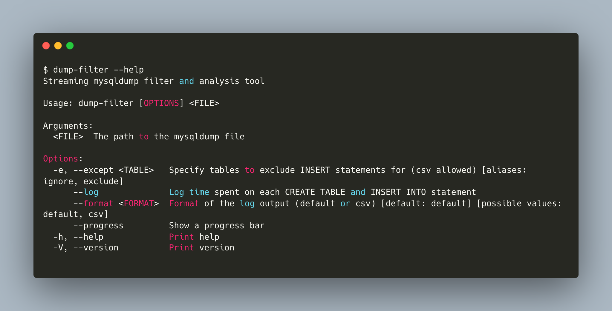

# dump-filter

## Installation
Either download the binary for your platfor from the latest release, or build from source.
```shell
# Clone the repository, then
cargo install --path .
```
## Examples
Pipe dump to mysql, ignoring INSERT statements for comments and reactions, while showing progress and logging time spent on each statement.
```shell
dump-filter --progress --log --exclude comments,reactions dump.sql | mysql dbname
```